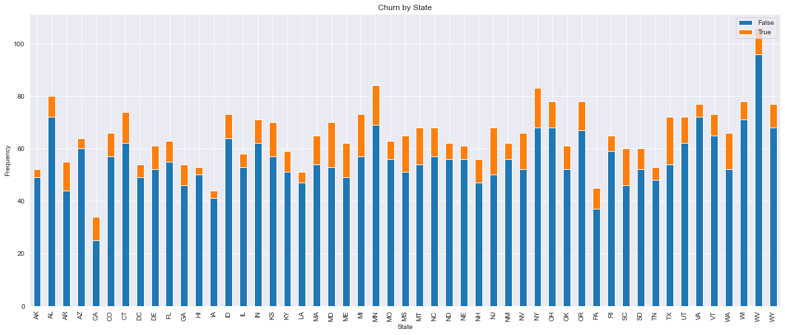
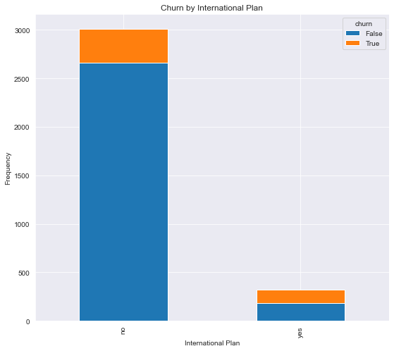
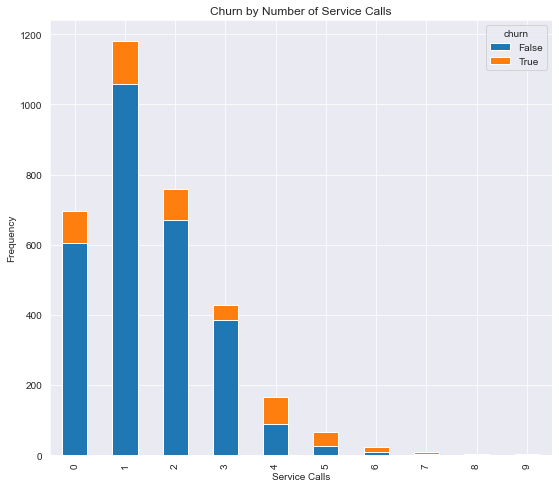

## SyriaTel Customer Churn Analysis
**Predicting Customer Churn using Classification Machine Learning**

**Author**: [Nate Kist](mailto:natekist@outlook.com)

## Overview

I analyzed a database of customer data from SyriaTel to determine which customers were churning the most and to predict if a customer was likely to churn soon.  Correct prediction of this type of binary classification can be used by SyriaTel as an early warning system indicating customers at risk of leaving.  From there, SyriaTel can then make business decisions of what to offer its at risk customers in the form of incentives to stay.  

It was found that customers from Maryland, New Jersey, and Texas were churning the most.  Similarly, customers with international plans and customers with 5 or more customer service calls were churning at higher rates.  It was recommended that SyriaTel look into the real-world drivers of these identified issues.  

In the end, I created a classification model that correctly predicted churn with 96% accuracy.  It was recommended that SyriaTel implement this model in its active marketing strategy to prevent loss of customers.  

## Business Understanding

SyriaTel, a US-based telecommunications company, asked me (Nate Kist, of CRM Consulting) to perform an analysis on its customer data to:
1. Provide insight on groups of customers that are churning at higher rates, and
2. Create a model that can predict whether a customer will churn.

## Data Understanding

- No nulls.  No need to impute anything.  
- 3333 rows.  21 columns.  
- Ignore phone number. y will be churn series. Everything else will be in X.  

## Data Preparation
- Figure out feature types for the purpose of column transformers
- Train, test, split the data:  Used a 65%/35% train/test split of the data.  
- Create column transformers:  For numeric columns, I scaled the data.  For categorical columns, I one-hot encoded them.  

## Exploratory Data Analysis 

### Churn by State


### Churn by International Plan


### Churn by Number of Service Calls



## Modeling
### Baseline Model
First step in modeling is to create a baseline model.  Common approach for this is to use the DummyClassifier estimator.

### Round 1 - Simple Models (default hyperparameters)
Create simple models with default hyperparameters.  Since the column transformers will not change, all pipelines will be set up the same, while just swapping out the model type.  Models utilized were:  LogisticRegression, DecisionTreeClassifier, KNearestNeighbors, RandomForestClassifier, SVCClassifier, GradientBoostingClassifier, and XGBoost Classifier.  In Round 1, the XGBoost, Gradient Booster, and Random Forest classifiers performed the best on test data.

### Round 2 - Simple Models with Balanced Data
As we can see below, the target classes are pretty unbalanced (86%/14%).  In this section, I add SMOTE to the pipeline to see if we can get any better results with the simple models. I add a SMOTE transformer into the model pipeline and rerun all models, showing the results of both on original data and on balanced data for comparative purposes.  Using SMOTE to balance the data did not notably improve any of the models performance, and in fact it decreased the performance of most of the models.  It appears that using data as is (86/14 split) is not that bad for the models.  This would align with the 90/10 split threshold discussed during our class.  As such, I will not use SMOTE going forward in the next round of modeling.  

### Round 3 - Hyperparameter Tuning the 3 Best Performing Models
In Round 3, I took the best performing models from Round 1 (XGBoost, Gradient Booster, and Random Forest) and used gridsearching to obtain the best hyperparameters for each.  XGBoost was the model with the best accuracy on test data using gridsearching.  It had an accuracy of 96%.  

### Best Model

XGBoost was the model with the best accuracy on test data using gridsearching.  It had an accuracy of 96%.  
Best Hyperparameters:

- 'model__learning_rate': 0.5
- 'model__max_depth': 6
- 'model__min_child_weight': 0
- 'model__subsample': 1.0

## Evaluation / Results

**High churn groups**
- Higher churn was identified in states like Maryland, New Jersey, and Texas.  It was also identified in customers with international plans and customers with 5 or more customer service calls.  Recommend SyriaTel looking into world drivers of these identified issues.

**Classification model:**
- XGBoost was the model with the best accuracy on unseen test data.  It performed with an accuracy of 96%.  It is recommended that SyriaTel implement this model in its active marketing strategy to prevent loss of customers.  

## Next Steps

- **More customer data:** We were able to create a model with 96% accuracy on limited data.  The more data that can be provided (data on more customers or additional data on each customer), it is possible we can improve the model's accuracy further.  


- **Customer retention plan:** Once you know which customers are at risk of leaving, you should have a plan for what you will offer them to stay that both minimizes the cost of retention but also alleviates their risk of leaving.    

## For More Information   

See the full analysis in the [Jupyter Notebook](./index.ipynb) or review this [presentation](./presentation.pdf).

**For additional info, contact:**
- Nate Kist: natekist@outlook.com

## Repository Structure

```
├── images
│   ├── header.jpg
│   ├── header2.jpg
│   ├── 1.png
│   ├── 2.png
│   ├── 3.png
│   ├── feedback.png
├── data
│   ├── bigml_59c28831336c6604c800002a.csv
├── notebook.ipynb
├── presentation.pdf
└── README.md
```


